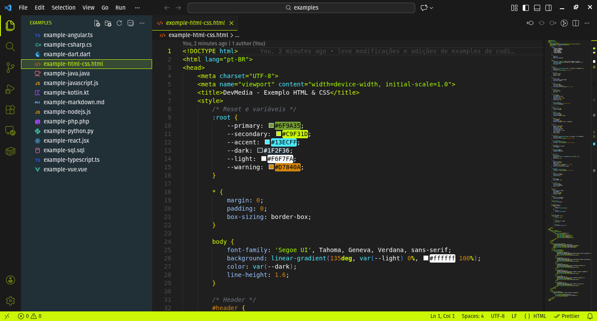
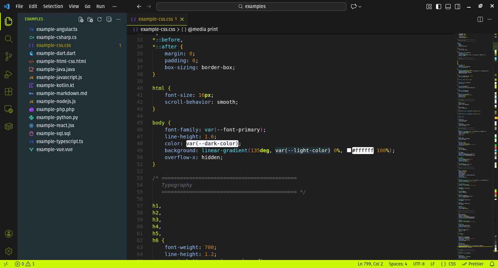
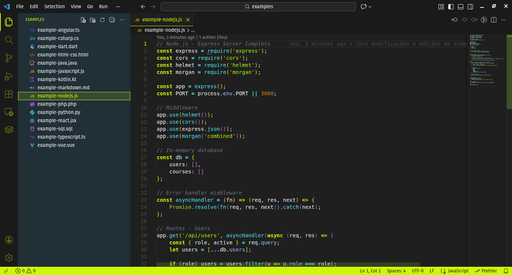
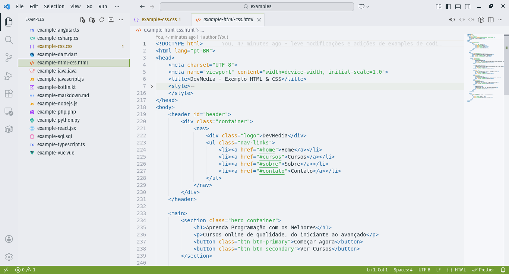
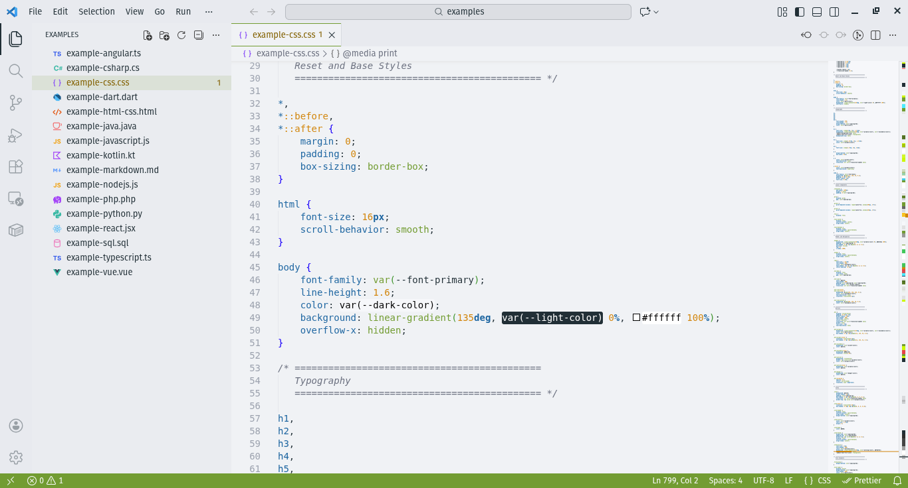

# DevMedia Theme

Tema não oficial para VS Code inspirado nas cores da [DevMedia](https://www.devmedia.com.br/) - Plataforma para Programadores.

## 🎯 Sobre

Este tema foi criado por um estudante da DevMedia como iniciativa pessoal, inspirado nas cores e identidade visual da plataforma. **Não é um tema oficial da DevMedia.**

## ✨ Características

- 🎨 **Duas variações**: Dark e Light
- 🌈 **Cores baseadas na identidade visual da DevMedia**
- 💻 **Suporte completo para as principais linguagens**:
  - HTML & CSS
  - JavaScript / TypeScript
  - React / React Native / JSX
  - Node.js / Express
  - Python (com decorators e self)
  - Java / Kotlin (com annotations)
  - PHP
  - SQL / MySQL
  - C# / .NET
  - Dart / Flutter
  - Angular / Vue.js
  - Markdown
  - JSON
  - E muitas outras!

## 🎨 Paleta de Cores

### Tema Dark

**Cores Principais:**

- **Destaque Principal**: `#6F9A35` (Verde oliva DevMedia)
- **Destaque Secundário**: `#C9F31D` (Verde-lima)
- **Background Editor**: `#1F1F1F` (Cinza escuro)
- **Background Activity Bar**: `#1A1A1A` (Preto suave)
- **Background Sidebar**: `#1F2F36` (Azul escuro)
- **Texto Principal**: `#F6F7FA` (Branco suave)
- **Status Bar**: `#6F9A35` (Verde oliva)
- **Azul Cyan**: `#13ECFF` (Funções e operadores)
- **Laranja**: `#D7840A` (Números e warnings)
- **Verde Strings**: `#A0F31D` (Strings)

**Sintaxe:**

- **Comentários**: `#6b7280` (Cinza, itálico)
- **Strings**: `#A0F31D` (Verde claro)
- **Números**: `#D7840A` (Laranja)
- **Keywords**: `#C9F31D` (Verde-lima, negrito)
- **Funções**: `#13ECFF` (Cyan)
- **Classes**: `#6F9A35` (Verde oliva, negrito)
- **Operadores**: `#13ECFF` (Cyan)
- **Propriedades**: `#93c5fd` (Azul claro)

### Tema Light

**Cores Principais:**

- **Destaque Principal**: `#6F9A35` (Verde oliva DevMedia)
- **Background Editor**: `#F0F2F5` (Cinza muito claro)
- **Background Activity Bar**: `#E8EAEF` (Cinza claro)
- **Background Sidebar**: `#EAECF0` (Cinza claro)
- **Texto Principal**: `#1F2F36` (Azul escuro)
- **Status Bar**: `#6F9A35` (Verde oliva)
- **Azul**: `#0369A1` (Keywords e links)
- **Cyan**: `#0891B2` (Operadores)
- **Laranja**: `#D7840A` (Classes e números)

**Sintaxe:**

- **Comentários**: `#6B7280` (Cinza, itálico)
- **Strings**: `#16A34A` (Verde)
- **Números**: `#D7840A` (Laranja)
- **Keywords**: `#0369A1` (Azul, negrito)
- **Funções**: `#6F9A35` (Verde oliva)
- **Classes**: `#D7840A` (Laranja, negrito)
- **Operadores**: `#0891B2` (Cyan)
- **Propriedades**: `#0369A1` (Azul)

## 🚀 Como Usar

Após a instalação:

1. Abra as configurações de tema: `Ctrl/Cmd + K, Ctrl/Cmd + T`
2. Selecione **DevMedia Dark** ou **DevMedia Light**
3. Comece a programar com estilo! 💪

## 📸 Screenshots

### DevMedia Dark

#### Example HTML

#### Example CSS

#### Example JavaScript

### DevMedia Light

#### Example HTML

#### Example CSS

### Descrição dos Temas

**DevMedia Dark**: Tema escuro com destaque em verde oliva (#6F9A35), ideal para longas sessões de programação com menos fadiga visual. Keywords destacados em verde-lima (#C9F31D) para melhor visibilidade.

**DevMedia Light**: Tema claro com destaque em verde oliva (#6F9A35), perfeito para ambientes bem iluminados e preferências por temas claros.

## 🛠️ Tecnologias Destacadas

Este tema oferece destaque de sintaxe otimizado para:

### Frontend

- HTML, CSS, SCSS/SASS
- JavaScript, TypeScript
- React, Angular, Vue.js
- JSX/TSX

### Backend

- Node.js, Express
- Python (com suporte a decorators)
- Java (com suporte a annotations)
- PHP
- C#, .NET

### Mobile

- React Native
- Flutter, Dart
- Kotlin

### Banco de Dados

- SQL, MySQL
- PostgreSQL

### Outras Ferramentas

- JSON
- Markdown
- Git (decorações coloridas)
- RegEx
- Docker

## 🎯 Destaques Especiais

- **Python**: Suporte completo para decorators (`@decorator`) e `self` em classes
- **Java/Kotlin**: Destaque para annotations (`@Override`, `@Deprecated`)
- **React/JSX**: Componentes destacados com cores distintas
- **SQL**: Keywords em negrito para melhor legibilidade
- **Markdown**: Formatação completa (headings, bold, italic, code, links)
- **Git**: Decorações coloridas para status:
  - Modified: Cyan
  - Added: Verde
  - Deleted: Vermelho
  - Untracked: Verde claro
  - Conflicting: Laranja

## 🤝 Contribuindo

Contribuições são bem-vindas! Sinta-se à vontade para:

1. Fazer fork do projeto
2. Criar uma branch para sua feature (`git checkout -b feature/MinhaFeature`)
3. Commit suas mudanças (`git commit -m 'Add: MinhaFeature'`)
4. Push para a branch (`git push origin feature/MinhaFeature`)
5. Abrir um Pull Request

### Sugestões de Melhorias

- Adicionar mais linguagens
- Melhorar contraste de cores específicas
- Adicionar variações de tema (ex: alto contraste)
- Reportar bugs ou inconsistências

## 📝 Changelog

Veja o arquivo [CHANGELOG.md](CHANGELOG.md) para detalhes sobre as versões e atualizações.

## 👤 Autor

**João Braga**

- GitHub: [@joaomjbraga](https://github.com/joaomjbraga)
- Estudante DevMedia

## 📄 Licença

Este projeto está sob a licença MIT. Veja o arquivo [LICENSE](LICENSE) para mais detalhes.

## ⚠️ Aviso

Este é um projeto pessoal criado por um estudante da DevMedia. **Não é um tema oficial** da plataforma DevMedia. Todas as marcas e logos pertencem aos seus respectivos proprietários.

## 💖 Agradecimentos

- À [DevMedia](https://www.devmedia.com.br/) pela excelente plataforma de ensino
- À comunidade de desenvolvedores que contribui para o crescimento da tecnologia no Brasil
- A todos que testaram e deram feedback sobre o tema

## 🔧 Instalação Manual

Se preferir instalar manualmente:

1. Clone este repositório
2. Copie a pasta do tema para `~/.vscode/extensions/`
3. Reinicie o VS Code
4. Selecione o tema nas configurações

## 🐛 Reportar Problemas

Encontrou um bug ou tem uma sugestão?

- Abra uma [issue no GitHub](https://github.com/joaomjbraga/devmedia-theme/issues)
- Descreva o problema detalhadamente
- Inclua screenshots se possível
- Mencione sua versão do VS Code

---

**Aprenda a Programar de Verdade com DevMedia! 🚀**

Se você gostou deste tema, considere deixar uma ⭐ no repositório!
