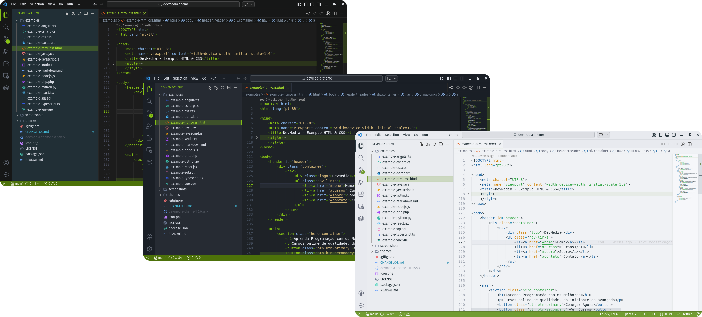
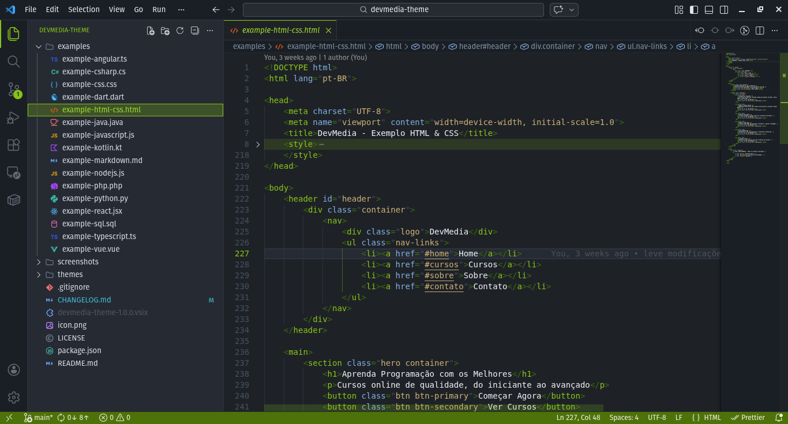

# DevMedia Theme

Tema não oficial para VS Code inspirado nas cores da [DevMedia](https://www.devmedia.com.br/) - Plataforma para Programadores.

## 🎯 Sobre

Este tema foi criado por um estudante da DevMedia como iniciativa pessoal, inspirado nas cores e identidade visual da plataforma. **Não é um tema oficial da DevMedia.**

## 📸 Screenshots

### DevMedia Dark

#### Example HTML

### DevMedia Dark Modern

#### Example HTML

### DevMedia Light

#### Example HTML

## 🤝 Contribuindo

Contribuições são bem-vindas! Sinta-se à vontade para:

1. Fazer fork do projeto
2. Criar uma branch para sua feature (`git checkout -b feature/MinhaFeature`)
3. Commit suas mudanças (`git commit -m 'Add: MinhaFeature'`)
4. Push para a branch (`git push origin feature/MinhaFeature`)
5. Abrir um Pull Request

### Sugestões de Melhorias

- Adicionar mais linguagens
- Melhorar contraste de cores específicas
- Adicionar variações de tema (ex: alto contraste)
- Reportar bugs ou inconsistências

## 📝 Changelog

Veja o arquivo [CHANGELOG.md](CHANGELOG.md) para detalhes sobre as versões e atualizações.

## ⚠️ Aviso

Este é um projeto pessoal criado por um estudante da DevMedia. **Não é um tema oficial** da plataforma DevMedia. Todas as marcas e logos pertencem aos seus respectivos proprietários.

## 💖 Agradecimentos

- À [DevMedia](https://www.devmedia.com.br/) pela excelente plataforma de ensino
- À comunidade de desenvolvedores que contribui para o crescimento da tecnologia no Brasil
- A todos que testaram e deram feedback sobre o tema

## 🐛 Reportar Problemas

Encontrou um bug ou tem uma sugestão?

- Abra uma [issue no GitHub](https://github.com/joaomjbraga/devmedia-theme/issues)
- Descreva o problema detalhadamente
- Inclua screenshots se possível
- Mencione sua versão do VS Code

---

## Suporte

Reporte issues em:
[https://github.com/joaomjbraga/devmedia-theme/issues](https://github.com/joaomjbraga/devmedia-theme/issues)

| 

**Aprenda a Programar de Verdade com DevMedia! 🚀**

Se você gostou deste tema, considere deixar uma ⭐ no repositório!

## 📄 Licença

Este projeto está sob a licença MIT. Veja o arquivo [LICENSE](LICENSE) para mais detalhes.
